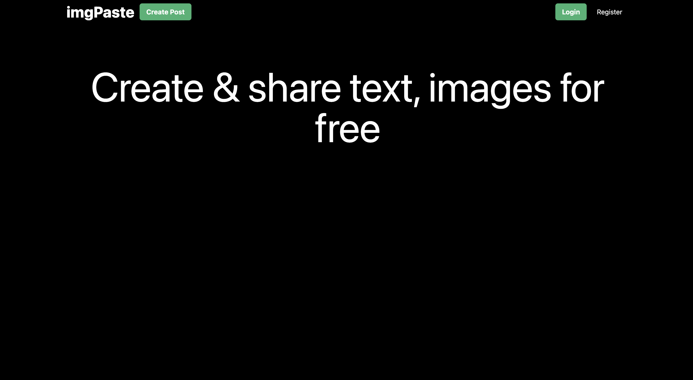
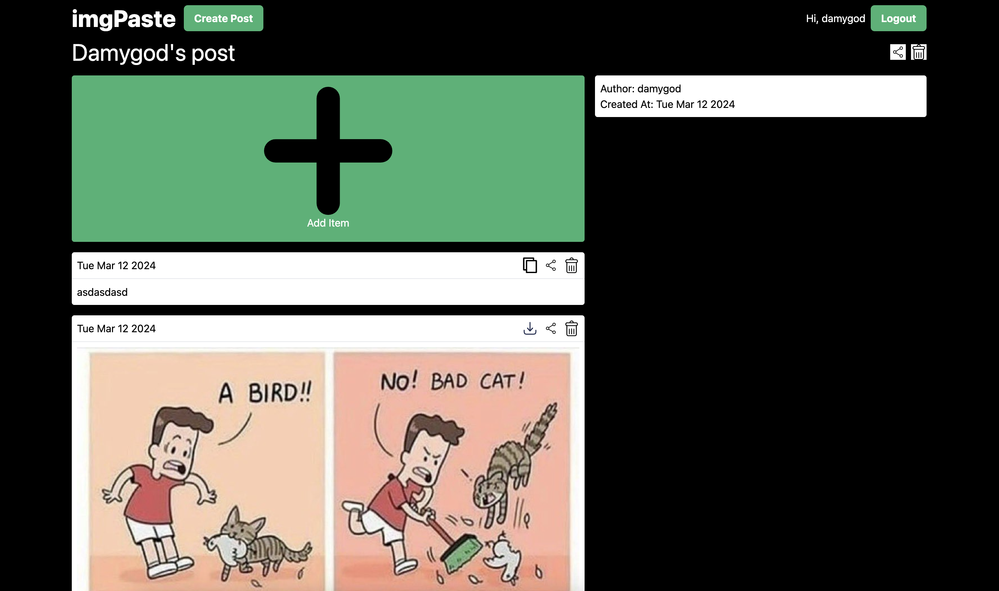
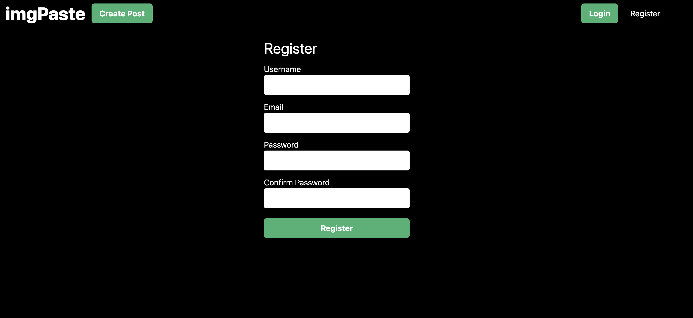
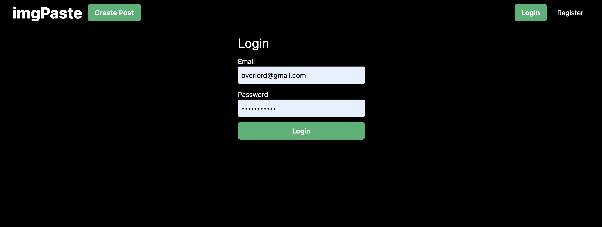

# imgPaste

imgPaste is a site where you can share images and text with others. It is a combination of [imgur](https://imgur.com) and [pastebin](https://pastebin.com).

## Features

- Authentication and Authorization with email & password
- Upload & Share images and text
- Download images
- Copy text

## Frontend Stack

- [Reactjs](https://reactjs.org) - A JavaScript library for building user interfaces
- [TypeScript](https://www.typescriptlang.org) - A typed superset of JavaScript that compiles to plain JavaScript
- [Vite](https://vitejs.dev) - Next Generation Frontend Tooling
- [Tailwind css](https://tailwindcss.com) - CSS toolkit
- [Axios](https://axios-http.com) - Promise based HTTP client for the browser and node.js

## Backend Stack

- [Nodejs](https://nodejs.org) - A JavaScript runtime built on Chrome's V8 JavaScript engine
- [Express](https://expressjs.com) - Fast, unopinionated, minimalist web framework for Node.js
- [Prisma](https://www.prisma.io) - Next-generation Node.js and TypeScript ORM
- [Java Spring Boot](https://spring.io/projects/spring-boot) - Production-ready Java backend framework
- [Spring Data JPA](https://spring.io/projects/spring-data-jpa) - Java ORM for database access
- [PostgreSQL](https://www.postgresql.org/) - Advanced open source relational database

## Running the site

In both client and server directory, create a `.env` file according to the `.env.example` file.

```bash
# Run any one of server express or java

# Run the Express server
cd express-server
npm install
npx prisma generate
npm start   # for production
npm run dev # for development
# Server runs on port 3000 by default

# Run the Java Spring Boot server
cd java-server
./gradlew build
./gradlew bootRun
# Java server runs on port 3000 by default

# Run the client
cd client
npm install
npm start   # for production
npm run dev # for development
# Client runs on port 5173 by default
```

## Site Screenshots

<div style="display: grid; grid-template-columns: repeat(2, 1fr); gap: 10px;">
  
  
  
  
</div>
